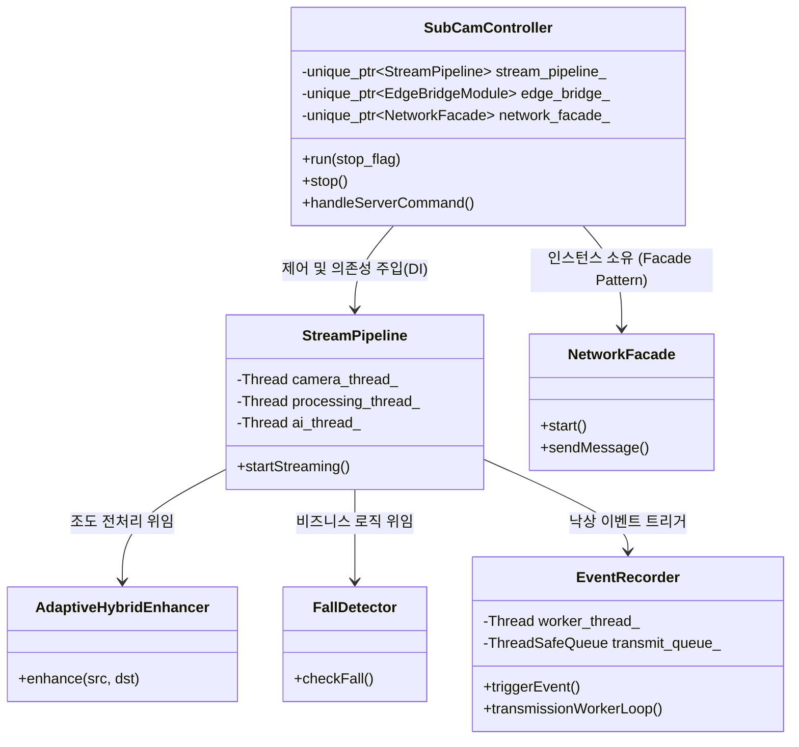
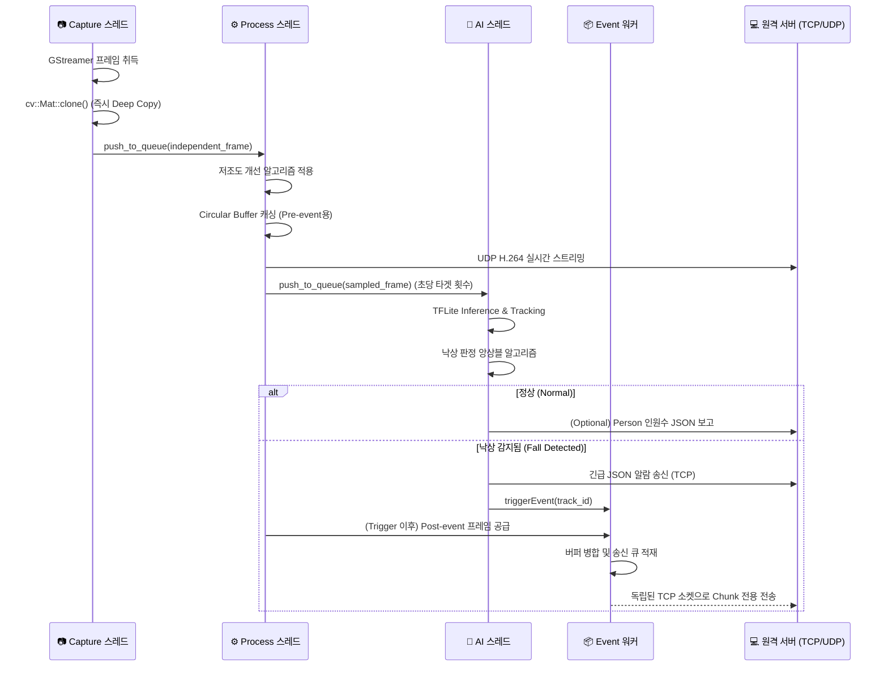

# SubCameraApp: AI-Powered Edge Surveillance System

<div align="center">
  
  
  
  
  
</div>

**SubCameraApp**은 라즈베리 파이 4B(Raspberry Pi 4B) 엣지 디바이스 환경을 위해 설계된 **실시간 지능형 영상 감시 시스템**입니다. GStreamer 하드웨어 가속 기반의 고성능 비디오 스트리밍과 TensorFlow Lite 옵티마이징을 거친 AI 신경망 추론 기능을 통합하여, 네트워크 지연 및 하드웨어 자원의 한계를 극복하는 산업용 등급의 안정성을 제공합니다.

---

## 🚀 1. 주요 기능 (Key Features)

시스템은 단순한 영상 송출을 넘어, 인지 기반의 스마트 이벤트를 지원하기 위해 아래와 같은 심층 기술을 활용합니다.

- **고성능 로우-레이턴시 스트리밍**: 
  - `libcamerasrc` 및 `v4l2convert` 기반의 하드웨어 스케일러를 활용하여 1080p 원본을 640x480 해상도로 CPU 개입 없이 리사이징.
  - H.264 하드웨어 인코더(`v4l2h264enc`)를 거쳐 30 FPS, 2 Mbps의 비트레이트로 UDP 스트리밍 송출.
- **실시간 AI 추론 및 분석**: 
  - 경량화된 `YOLO26n-Pose (int8)` 모델을 활용하여 실시간 객체 탐지 및 17포인트 골격(Skeleton) 추출.
  - 다중 파라미터(신체 압축률, 척추 각도 등) 기반의 휴리스틱 앙상블 낙상 감지(Fall Detection).
- **스마트 이벤트 레코딩**: 
  - 순환 버퍼(Circular Frame Buffer)를 사용하여 낙상 감지 시점 이전 2초(Pre-event)부터 3초(Post-event)까지의 핵심 상황 클립 녹화 및 비동기 TCP 청크 분할 전송.
- **런타임 및 시스템 안정성 방어기재 (2026-03-20 Update)**:
  - **`ProcessGuard`**: 시스템 레벨의 프로세스 충돌 방지 유틸리티. 앱 가동 전 `/dev/video0` 점유 상태를 파악하고 기존 좀비 프로세스를 자동 정리하여 하드웨어 자원 충돌을 원천 차단합니다.
  - **`Lazy GStreaming`**: 비디오 시스템 자원의 소모를 줄이기 위해, 실제 `open()` 요청이 들어올 때까지 `VideoCapture` 백엔드 객체 생성을 지연(Lazy Initialization)시켜 런타임 안정성을 극대화합니다.
  - **`Strict Command Protocol`**: 네트워크 상의 의미 없는 패킷이나 해킹 노이즈로 인한 크래시를 방지하기 위해, `compare()` 함수에 기반한 엄격한 접두어 명령어 검증(예: `START_STREAM:`)을 통해 시스템을 보호합니다.

---

## 🏗 2. 소프트웨어 아키텍처 및 SOLID 설계

본 프로젝트는 고도의 동시성 제어와 유지보수성 확립을 위해 SOLID 원칙을 기반으로 설계되었으며, 특히 **독립적인 4-스레드 파이프라인 구조**를 통해 부하를 분산합니다.

### 🔄 4-스레드 데이터 파이프라인
1. **Capture Thread (`cameraLoop`)**: 
   - 카메라로부터 원시 프레임을 수거합니다. GStreamer 백엔드와의 결합도를 낮추고 자원 누수를 막는 최선봉 스레드입니다.
2. **Process Thread (`processingLoop`)**: 
   - 캘리브레이션 및 적응형 조도 향상(Adaptive Image Enhancer) 등 이미지 전처리를 수행합니다.
   - H.264 네트워크 스트리밍 파이프라인으로 영상 데이터를 공급하고 이벤트 버퍼에 프레임을 할당합니다.
3. **AI Inference Thread (`aiWorkerLoop`)**: 
   - TFLite 텐서 연산을 수행합니다. 추출된 자세 추정 결괏값을 바탕으로 Tracking과 낙상 비즈니스 로직을 검증하고, 알람 대상일 경우 이벤트 트리거를 발동합니다.
4. **Transmission Thread (`transmissionWorkerLoop` in EventRecorder)**:
   - 메인 파이프의 병목을 막기 위해 분리된 워커 스레드로, 완료된 전후(Pre/Post) 이벤트 프레임 클립을 원격으로 송출합니다.

*이러한 분리는 단일 책임 원칙(SRP)과 인터페이스 분리 원칙(ISP)을 철저히 따르며, 추상화된 의존성(`IImageEnhancer`, `INetworkSender`)을 시스템 런쳐인 `SubCamController`에서 의존성 주입(DI)하여 제어 역전(IoC)을 만족시킵니다.*

---

## 📊 3. 도식화된 시스템 다이어그램

### 📌 Class Diagram (의존성 및 계층 구조)


### 📌 Sequence Diagram (프레임 데이터 흐름)


---

## ⚡ 4. 시스템 및 메모리 최적화 상세 요약

본 플랫폼은 제한된 RPi4의 자원을 한계점까지 끌어올리기 위한 다음과 같은 핵심 최적화를 탑재하고 있습니다.

1. **메모리 릭 및 버퍼 병목 완전 차단 (`cv::Mat` 복사 전략)**
   - GStreamer(libcamerasrc)의 고질적인 `RequestWrap` 누수 문제를 해결하기 위해, 영상 수신 시 `clone()`으로 메모리를 시스템 공간으로 즉각 옮깁니다. GStreamer 내부 버퍼풀 사용시간을 1ms 미만으로 극도로 단축하여 장기 동작 안정성을 끌어올렸습니다.
2. **AI 연산 Gating 메커니즘**
   - RPi4의 쿼드코어 부하를 관리하기 위하여 매 프레임 AI를 동작시키지 않습니다. `AppConfig::AI_INFERENCE_INTERVAL`를 기준으로 타임 슬라이스(Gating)하여 목표 FPS에 도달할 때에만 AI 스레드의 큐로 분할 적재하므로 `Empty Queue Access` 혹은 `Buffer Bloat` 크래시를 방지합니다.
3. **GStreamer 순수 하드웨어 가속**
   - VPU/ISP를 통과하는 파이프라인 토폴로지(`libcamerasrc ! v4l2convert ! videoflip ! videoconvert`)를 구성했습니다. 이를 통해 OpenCV의 소프트웨어 CPU 리사이징 부하를 걷어냅니다.
4. **OpenCV 백그라운드 스레드 점유 억제**
   - `cv::setNumThreads(1)`을 하드코딩하여 OpenCV 내부의 암시적 코어 선점을 막았습니다. 이에 따라 OS와 TFLite 텐서 엔진에 필수적인 논리적 코어 공간을 강제로 보존합니다.

---

## 📂 5. 프로젝트 디렉토리 구조 및 모듈명세 (`src/`)

| 디렉토리 | 주요 기능 및 역할 구조 | 핵심 클래스 및 파일 |
| :--- | :--- | :--- |
| `controller` | **최상급 코디네이터**: 파사드들을 생성-조립하고 앱 라이프사이클을 통제합니다. | `SubCamController` |
| `stream` | **메인 파이프라인 엔진**: 3대 주요 스레드를 관장하며 GStreamer 백엔드와 소통합니다. | `StreamPipeline`, `GStreamerCamera` |
| `buffer` | **이벤트 매니저**: 프레임 버퍼를 환형 관리하며 낙상 발생 전후의 영상을 패키징 및 비동기 전송합니다. | `CircularFrameBuffer`, `EventRecorder` |
| `ai` | **지능 검증부**: TFLite 신경망을 통해 객체 정보를 정제, 추적하고 룰베이스 판정법을 적용합니다. | `PoseEstimator`, `FallDetector` |
| `imageprocessing`| **영상 전처리 유틸리티**: 조도 분석 및 히스토그램 평활화, 색상공간 변환 등을 수행합니다. | `ImagePreprocessor`, `AdaptiveHybridEnhancer` |
| `network` | **통신 추상화 레이어**: TCP/UDP 소켓과 바이너리 프로토콜 직렬화를 전담합니다. | `NetworkFacade` |
| `edge_device` | **하드웨어 제어 브릿지**: 외부 장비(STM32)와의 UART 양방향 시리얼 프로토콜을 구현합니다. | `EdgeBridgeModule`, `Stm32Proto` |
| `system` | **자원 감시관**: 좀비 프로세스를 숙청하고 실시간 CPU/RAM 소모율을 보고합니다. | `ProcessGuard`, `SystemResourceMonitor` |
| `transmitter` | **데이터 링크**: 큰 사이즈의 이벤트 클립을 청크 단위로 분해하여 안전하게 TCP 소켓으로 밀어 올립니다. | `ChunkedStreamTransmitter` |

---

## 🛠 6. 필수 설치 조건 및 실행 방법 (Raspberry Pi OS)

### 환경 요구사항 (Prerequisites)
- Raspberry Pi OS (Debian 12 Bookworm 이상 권장)
- GStreamer 1.0 (with `libcamera` Plugin)
- OpenCV 4.x
- CMake 3.10+

### 패키지 의존성 셋업
```bash
sudo apt update
sudo apt install -y cmake g++ libopencv-dev
sudo apt install -y libgstreamer1.0-dev libgstreamer-plugins-base1.0-dev
sudo apt install -y gstreamer1.0-plugins-good gstreamer1.0-plugins-bad gstreamer1.0-libcamera
```

### 안정적인 카메라 자원 확보 (권장)
RPi 내장 서비스와 `libcamera` 간의 경합 방지를 위해 미디어 데몬 무력화가 필요할 수 있습니다.
```bash
sudo systemctl disable --now pipewire pipewire.socket wireplumber
```

### 소스 빌드 (Build)
```bash
mkdir build && cd build
cmake ..
# 4개의 코어를 풀 활용하여 빠른 병렬 빌드
make -j4
```

### 실행 (Execution)
하드웨어(UART, Camera 장치 등) 제어 권한 획득을 위해 `sudo` 권한을 권장합니다.
```bash
sudo ./subcam_main
```

---

## 📄 License
Copyright (c) 2026 SubCamera Project. All rights reserved. 본 프로젝트는 허가된 관계자 외 복제 및 상업적 사용을 금지합니다.
