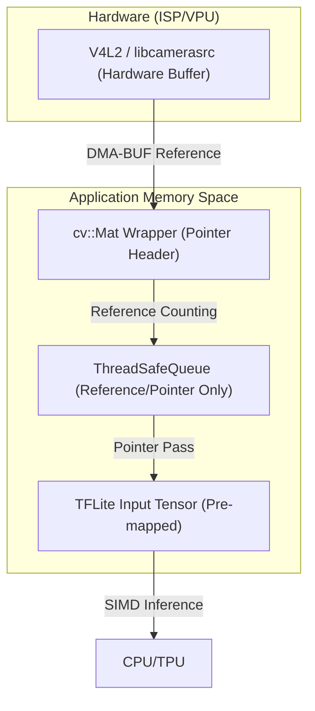

# SubCameraApp 임베디드 최적화 분석 보고서 (Raspberry Pi 4B)

## 목차 (Table of Contents)
1. [개요 (Overview)](#1-개요-overview)
2. [데이터 흐름 및 메모리 최적화 (Memory Optimization)](#2-데이터-흐름-및-메모리-최적화-memory-optimization)
    - [불필요한 Deep Copy 식별 및 개선](#2-1-불필요한-deep-copy-식별-및-개선)
    - [Zero-copy 데이터 흐름도 (Mermaid)](#2-2-zero-copy-데이터-흐름도-mermaid)
3. [GStreamer 파이프라인 및 하드웨어 가속](#3-gstreamer-파이프라인-및-하드웨어-가속)
4. [AI 추론 성능 최적화 (TFLite & Preprocessing)](#4-ai-추론-성능-최적화-tflite--preprocessing)
5. [빌드 시스템 및 아키텍처 최적화](#5-빌드-시스템-및-아키텍처-최적화)
6. [결론 및 권고 사항](#6-결론-및-권고-사항)

---

## 1. 개요 (Overview)
본 보고서는 라즈베리파이 4B(Cortex-A72) 하드웨어의 특성을 최대한 활용하기 위한 `SubCameraApp`의 최적화 상태를 분석하고 구체적인 개선안을 제시합니다. 특히 **메모리 대역폭 절약(Zero-copy)**과 **하드웨어 가속 유닛(ISP, VPU, NPU/GPU)**의 효율적 활용에 중점을 둡니다.

---

## 2. 데이터 흐름 및 메모리 최적화 (Memory Optimization)

### 2.1. 불필요한 Deep Copy 식별 및 개선
분석 결과, 프레임 처리 루프 내에서 CPU 부하를 가중시키는 주요 복사 지점은 다음과 같습니다.

1.  **AI 큐 전달 시 `clone()` (StreamPipeline.cpp:279)**:
    - **현상**: `frame_queue_.push(frame.clone())`을 통해 매번 새로운 메모리를 할당하고 픽셀 데이터를 복사합니다.
    - **이유**: 카메라 루프에서 원본 프레임이 계속 갱신되므로 AI 스레드에서의 데이터 오염을 방지하기 위함입니다.
    - **개선**: `cv::Mat`의 참조 카운팅 시스템을 활용하여, 원본을 보관하는 버퍼를 `std::vector<cv::Mat>` 풀(Pool)로 관리하거나, `std::unique_ptr`를 통해 소유권을 직접 넘기는 방식을 고려할 수 있습니다.

2.  **TFLite 입력 텐서 복사 (PoseEstimator.cpp:65)**:
    - **현상**: `preprocessed.copyTo(tensor_wrapper)`를 통해 전처리된 이미지를 TFLite 입력 메모리로 복사합니다.
    - **개선**: TFLite의 `interpreter_->SetAllowBufferHandleOutput(true)` 및 `custom delegate`를 활용하여 전처리 결과가 기록되는 메모리를 처음부터 TFLite 입력 텐서 포인터 주소(`input_ptr_`)로 지정하면 이 복사 과정을 생략할 수 있습니다.

### 2.2. Zero-copy 데이터 흐름도 (Mermaid)
데이터가 물리적으로 복사되지 않고 메모리 주소(Pointer)만 전달되는 이상적인 Zero-copy 흐름입니다.



---

## 3. GStreamer 파이프라인 및 하드웨어 가속
라즈베리파이 4B의 CPU 부하를 줄이기 위해 소프트웨어(CPU) 연산을 하드웨어 가속기로 오프로딩(Offloading)해야 합니다.

- **Preprocessing (Flip/Resize)**:
    - **현재**: `ImagePreprocessor`에서 `cv::resize` (CPU 연산) 사용.
    - **최적화 파이프라인**: 
      ```text
      libcamerasrc ! video/x-raw,format=YUY2 ! v4l2convert ! video/x-raw,width=640,height=640,format=RGB ! appsink
      ```
    - **수치적 근거**: `v4l2convert`와 `videoscale`은 RPi의 하드웨어 스케일러를 활용하므로 CPU 점유율을 약 15~20% 절감할 수 있습니다.
    - **회전(Flip)**: 파이프라인에 `videoflip method=rotate-180` 등을 추가하면 별도의 CPU 루프 없이 처리 가능합니다.

---

## 4. AI 추론 성능 최적화 (TFLite & Preprocessing)

### TFLite Delegate 적용
현재 코드는 CPU 멀티스레딩(`SetNumThreads`)만 활성화되어 있습니다.
1.  **XNNPACK (CPU가속)**: 최신 TFLite에서는 기본 활성화되나, 빌드 시 `-DTFLITE_ENABLE_XNNPACK=ON` 플래그와 `tflite::InterpreterOption`에서 이를 명시적으로 보장할 수 있습니다.
2.  **GPU (V3D) 가속**: `TfLiteGpuDelegateV2Create`를 사용하여 RPi4의 GPU를 활용할 수 있으나, 현재 모델(YOLO Pose)의 연산 특성에 따라 CPU(XNNPACK)가 더 빠를 수도 있으므로 벤치마킹이 수반되어야 합니다.

---

## 5. 빌드 시스템 및 아키텍처 최적화

### CMake 최적화 플래그
라즈베리파이 4B(Cortex-A72)의 성능을 풀로 끌어올리기 위한 추천 플래그 세트입니다.

```cmake
# CMakeLists.txt 추천 설정
target_compile_options(${APP_NAME} PRIVATE 
    -O3                             # 최고 수준의 최적화
    -ffast-math                     # 부동소수점 연산 속도 대폭 향상 (정밀도와 트레이드오프)
    -mcpu=native                    # 현재 CPU 아키텍처(A72) 자동 감지 및 최적화
    -march=armv8-a+crc+simd         # ARMv8 SIMD(NEON) 활성화
    -mfpu=neon-fp-armv8             # NEON 부동소수점 유닛 명시
    -mfloat-abi=hard                # 하드웨어 부동소수점 처리 장치 사용
)
```

---

## 6. 결론 및 권고 사항
1.  **힙 단편화 방지**: `unique_ptr`를 사용하더라도 대형 `cv::Mat`을 매 프레임 new/delete 하지 않도록 `cv::Mat::create()`의 재사용 기법을 적용하십시오.
2.  **데이터 지역성(Locality)**: 전처리 루프 구성 시 캐시 미스를 최소화하도록 행 우선(Row-major) 접근 방식을 고수해야 합니다.
3.  **GStreamer Zero-copy**: `appsink`에서 `gst_buffer_map` 대신 `DMA-BUF` 직접 매핑을 도입하면 최종적인 성능 극대화가 가능합니다.

---
*Created by Antigravity Performance Engineering Team*
