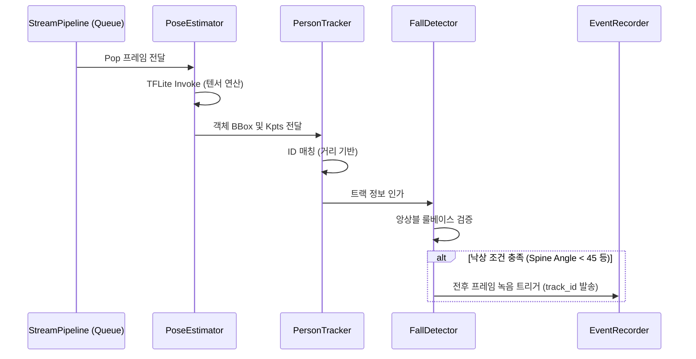

# ai Module Engineering Specification

## Module Specification
해당 폴더는 TFLite 텐서 연산을 통해 프레임 내 객체의 관절(Pose) 좌표를 추출하고, 다중 프레임 간의 시계열 데이터를 분석하여 낙상(Fall) 이벤트를 판정하는 핵심 지능 추론 모듈이다.

## Technical Implementation
- **`PoseEstimator`**: TFLite C++ API를 래핑하여 `YOLOv8-Pose (Int8)` 양자화 모델을 구동하며, 정규화된 텐서를 입력받아 Bounding Box와 17-Point Skeleton 비정규화 연산을 수행한다.
- **`PersonTracker`**: 이전 프레임의 객체 중심점과 현재 객체 간의 유클리디언 거리(Euclidean Distance)를 기반으로 고유 ID를 할당하여 객체의 연속성을 보장한다.
- **`FallDetector`**: 트래킹된 객체의 신체 압축률(Height/Width Ratio 변화 반전), BBox의 기울기 각도(Spine Angle), 그리고 이동 하강 속도(Y-velocity)를 종합하는 휴리스틱 앙상블(Heuristic Ensemble) 알고리즘을 수행하여 낙상을 판정한다.

## Inter-Module Dependency
- **Input**: `stream` 파이프라인의 `processing_queue`에서 전처리(Resized & Normalized)된 `cv::Mat` 데이터를 비동기로 매 틱마다 수신한다.
- **Output**: 낙상 판정 시 `buffer` 모듈의 `EventRecorder`에 트리거 신호를 인가하며, `network`의 `NetworkFacade`를 통해 JSON 형태의 긴급 알람을 원격지로 송출한다.
- **Shared Resource**: 스레드 안전 큐(`ThreadSafeQueue`)를 통해 메인 스트림과 프레임 데이터를 교환한다.

## Optimization Logic
- **AI Inference Gating (CPU Gating)**: 모든 프레임에 대해 연산을 수행하지 않고 `AI_INFERENCE_INTERVAL` 상수에 의해 특정 샘플링 주기로만 연산하여 RPi4의 CPU 병목(Buffer Bloat) 현상을 방지한다.
- **Lock-free Data Access**: 추론 스레드 내부에서 OpenCV의 자체 백그라운드 스레드 생성(`cv::setNumThreads(1)`)을 억제하여 TFLite 인터프리터의 논리 코어 점유를 단독 보장(Thread-Binding 방어)하였다.

## Data Flow Diagram

