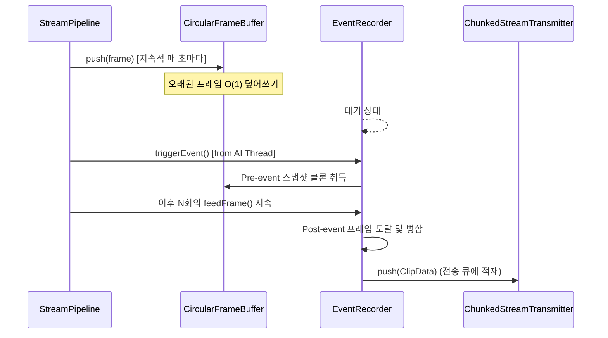

# buffer Module Engineering Specification

## Module Specification
실시간 파이프라인 진행 중 특정 AI 이벤트 감지 이전(Pre-event) 영상과 이후(Post-event) 캡처 프레임들을 유실 없이 캐싱하고 병합하여 비동기 전송할 수 있도록 관리하는 순환 메모리 패키징 모듈이다.

## Technical Implementation
- **`CircularFrameBuffer`**: 고정된 힙 배열(Vector)과 Read/Write Index 포인터를 사용하여 과거 N초 분량의 프레임을 덮어쓰기 방식으로 저장하는 환형 큐 자료구조이다.
- **`EventRecorder`**: AI 트리거 발생 지점을 기준으로 버퍼에서 `Pre-event` 프레임을 복사 스냅샷으로 뜨고, 이후 인입되는 프레임을 `Post-event` 버퍼에 누적한 뒤, 타겟 프레임 수 도달 시 청크 묶음(`ClipData`)으로 병합하는 구조이다.

## Inter-Module Dependency
- **Input**: `stream` 모듈의 연산 처리 스레드로부터 1 FPS 로 샘플링된 프레임을 지속적으로 주입(`push`) 받으며, `ai` 모듈로부터 녹화 시작 트리거를 수신한다.
- **Output**: 생성 완료된 이벤트 클립은 `transmitter` 모듈의 `IStreamTransmitter` 인터페이스로 밀어올려 비동기 TCP 전송망에 태운다.

## Optimization Logic
- **O(1) Memory Allocation (Zero-allocation during loop)**: 초기에 고정된 크기(`vector::reserve`)로 할당된 환형 버퍼 포인터만 스와핑하여, 영상 스트리밍 진행 중 운영체제의 동적 메모리 할당(Malloc) 지연을 완벽 차단한다.
- **Backpressure Protection**: 네트워크 대역폭 부족 상황에 대비하여, 생성 대기 큐 크기를 `EVENT_RECORDER_MAX_PENDING` 지정값으로 하드 리밋(Hard Limit)하여 Out-Of-Memory(OOM)를 방어한다.

## Data Flow Diagram

