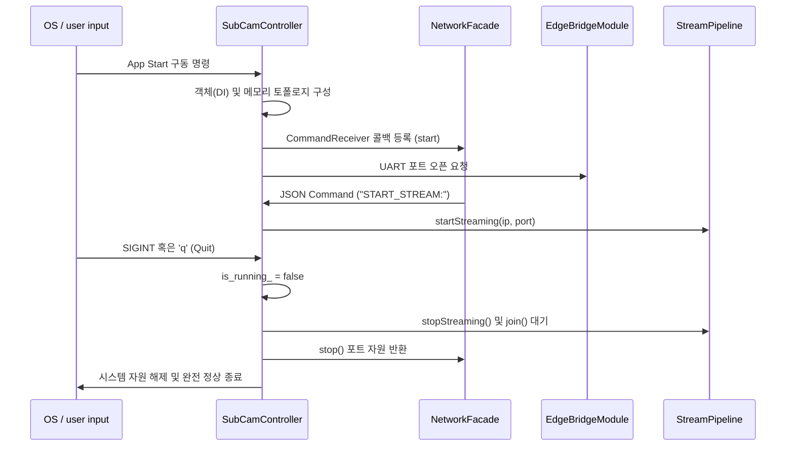

# controller Module Engineering Specification

## Module Specification
시스템 구동에 필요한 전역 설정 로드, 하위 모듈 간 의존성 주입(DI), 프로세스 라이프사이클(초기화/구동/종료) 제어를 총괄하며 스레드 간의 안전한 종료(Graceful Shutdown)를 관장하는 최상위 오케스트레이터 모듈이다.

## Technical Implementation
- **`SubCamController`**: 애플리케이션 생성자 단계에서 `NetworkFacade`, `GStreamerCamera`, `StreamPipeline`, `EdgeBridgeModule` 등의 모든 구체 클래스를 `std::make_unique`로 인스턴스화하고 인터페이스 계층으로 조립한다.
- **Graceful Shutdown Sequence**: `stop()` 메서드를 통해 인터럽트(`SIGINT` 등) 발생 시 각 스레드 루프에 진입해 있는 wait 객체들을 순차적으로 `notify_all()`하여 인터럽션 포인트를 제공하고, 최종적으로 `join()`을 보증한다.

## Inter-Module Dependency
- **Input**: 서버 또는 운영체제로 부터 기동/종료 시그널 및 네트워크 제어(JSON 텍스트 기반 명령)를 `NetworkFacade`의 리시버 콜백을 통해 수신한다.
- **Output**: 수신된 명령 분기 결과에 따라 `EdgeBridgeModule`로 하드웨어 제어 시그널을 보내거나 `StreamPipeline` 측에 시스템 중단 파라미터를 하달한다.
- **Dependency Hierarchy**: 본 시스템 상에서 거의 모든(`stream`, `edge_device`, `network`, `imageprocessing`) 모듈에 대한 생성자 주입의 소유권을 보유한다.

## Optimization Logic
- **Pointer Ownership & Memory Leak Prevention**: `std::unique_ptr` 및 C++11 Move Semantics(`std::move`)를 사용하여 런타임 종료 단계에서 할당 해제 누락(Memory Leak)이 물리적으로 불가하도록 RAII(Resource Acquisition Is Initialization) 패턴을 적용하였다.
- **Strict Command Parser**: `compare()` 기반의 문자열 바운더리 체크로 불완전 송신된 명령 프레임에 의한 메모리 크래쉬 현상을 원천 방어한다.

## Data Flow Diagram

