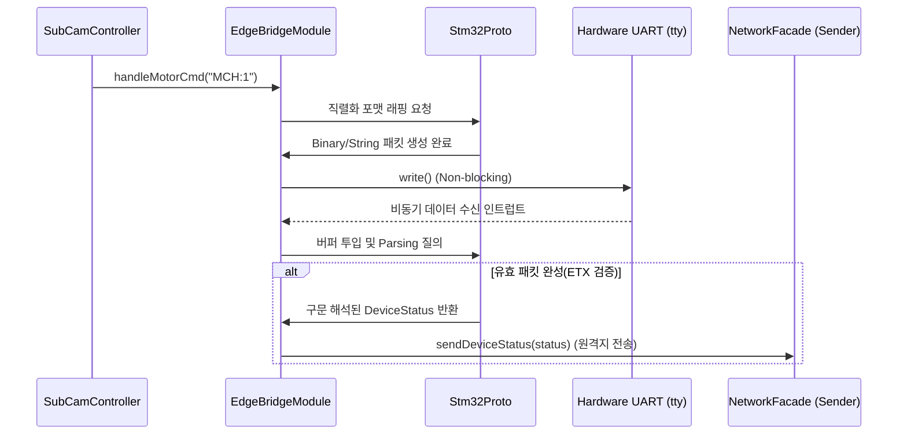

# edge_device Module Engineering Specification

## Module Specification
라즈베리 파이 엣지 노드와 하위 마이크로컨트롤러(STM32 등) 간의 물리적 UART 시리얼 라인을 통한 레지스터 제어 및 센서 상태 데이터 교환을 담당하는 양방향 브릿지 프로토콜 모듈이다.

## Technical Implementation
- **`EdgeBridgeModule`**: Linux `/dev/ttyS0` (혹은 `ttyAMA0`) 포트를 논블로킹으로 개방하고, 내부적으로 송/수신을 전담하는 비동기 워커 스레드를 할당하여 메인 OS 애플리케이션의 멈춤 현상을 방지한다.
- **`Stm32Proto`**: 바이너리 페이로드 파싱, 시작/종료 바이트(STX/ETX) 검증, CRC 또는 Checksum 에러 검사 등 하드웨어 레벨 프로토콜 처리를 수행하는 패킷 분해 조립기이다.

## Inter-Module Dependency
- **Input**: `controller` 모듈에서 원격 서버로부터 파싱한 상위 레벨의 JSON 명령(예: MCH, TILT 등 모터 제어 문자열)을 전달받는다.
- **Output**: 주기적으로 읽어들인 STM32 센서 상태값(배터리, IMU 등)을 `controller` 초기화 시 주입된 `INetworkSender` 인터페이스를 거쳐 원격 데이터베이스나 서버로 퍼블리싱(Publish)한다.
- **Shared Resource**: 파일 디스크립터(UART Serial File Descriptor) 접근용 `std::mutex` 기반 하드웨어 직렬화 락.

## Optimization Logic
- **Non-blocking FD Polling**: 시리얼 포트 읽기(Read) 루프에서 `poll()` 기반의 I/O 멀티플렉싱을 적용하여, 데이터가 없는 구간의 CPU 낭비(Busy-waiting)를 1% 미만으로 근절한다.
- **Buffer Fragmentation Handling (파편화 방지)**: 패킷이 쪼개져서 수신되더라도, 누적 버퍼 클래스를 활용해 STX부터 온전한 ETX가 매칭되기 전까지 데이터를 안전하게 캐싱(Concatenating) 조합한다.

## Data Flow Diagram

