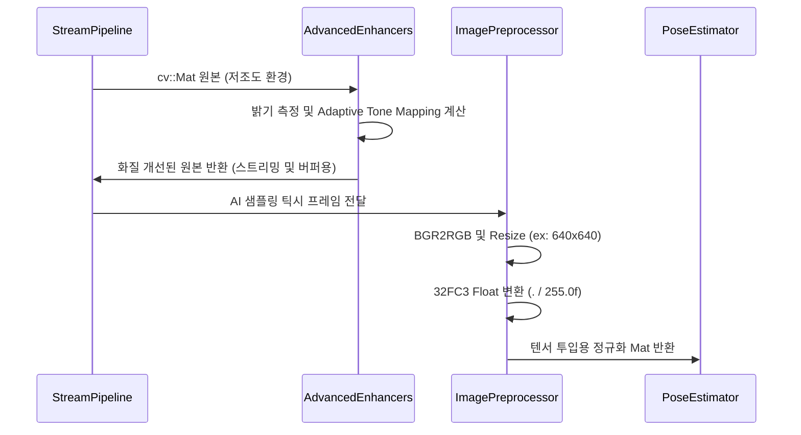

# imageprocessing Module Engineering Specification

## Module Specification
카메라로부터 수집된 원본 프레임의 조도를 분석·개선하고 텐서플로우 모델 규격에 맞추어 색상 변환 및 정규화를 수행하는 실시간 영상 전처리 파이프라인 모듈이다.

## Technical Implementation
- **`AdaptiveHybridEnhancer` / `LowLightEnhancer`**: 현재 영상의 평균 밝기(Luminosity)를 산출하여, 동적으로 `CLAHE`(대조비 개선) 및 `Retinex` 톤 매핑 계열의 알고리즘을 선택적용하는 픽셀 레벨 전처리기.
- **`ImagePreprocessor`**: `cv::resize` (Interpolation), `cv::cvtColor` (BGR to RGB 변환), `cv::convertTo` (부동소수점 정규화) 연산을 통해 AI 엔진이 요구하는 텐서(Tensor) 입력형태를 즉각 생성한다.

## Inter-Module Dependency
- **Input**: `stream` 모듈의 GStreamer 파이프라인에서 추출된 단일 `cv::Mat` 프레임 매트릭스를 입력받는다.
- **Output**: 화질 개선 및 정규화 계수가 적용된 새로운 `cv::Mat` 인스턴스를 반환하여 `ai` 객체 탐지기로 공급하며, H.264 인코더 출력을 위해 원본 스트림에도 적용형 화질 향상을 반영한다.

## Optimization Logic
- **In-place Operations 우대**: 메모리 동적 할당 오버헤드를 줄이기 위해 가능한 한 입력 스왑(In-place `dst = src`) 연산을 수행하며, `cv::UMat` 적용 불가 한계를 SIMD(AVX/NEON) 컴파일 최적화된 OpenCV 기본 함수에 전적으로 의존하여 CPU 명령 수행 주기를 단축시킨다.
- **Downscale Priority**: 원본(1080p) 자체에 무거운 픽셀 연산을 수행하지 않고, GStreamer 하드웨어 크롭/다운스케일(640x480)이 끝난 버퍼에만 화질 개선을 수행하여 연산량을 1/4 로 축소한다.

## Data Flow Diagram

