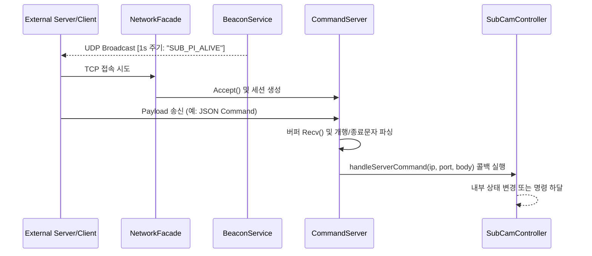

# network Module Engineering Specification

## Module Specification
UDP 브로드캐스트 기반의 장치 스캐닝(Beacon)과 TCP 소켓 통신을 통한 외부 JSON 명령 수신 등 OSI 7계층 기준 통신 세션을 추상화 및 은닉하는 통신 파사드 모듈이다.

## Technical Implementation
- **`NetworkFacade`**: 내부적으로 송수신에 특화된 여러 서브 시스템들을 통합하고 라이프사이클을 열거나 닫아주는 단일 진입점(Facade) 클래스이다.
- **`CommandServer`**: 멀티-클라이언트 접속을 지원하는 스트림 리스너. 클라이언트 소켓 Accept 직후 전용 워커 스레드를 발급하여 `std::string` 형태의 구문 명령어를 파싱한다.
- **`BeaconService`**: 엣지 디바이스 발견을 위한 UDP 멀티캐스트 혹은 브로드캐스트 Health-check 패킷을 N초 단위로 발산한다.

## Inter-Module Dependency
- **Input**: 서드파티 통합관제서버 혹은 모바일 디바이스로부터의 외부 TCP/UDP 통신 스트림 패킷.
- **Output**: 수신 처리된 문자열 명령은 함수 콜백(Callback) 형태로 `controller` 모듈(`SubCamController`)에 전달되어 JSON 파싱으로 넘겨진다. 또한 `transmitter` 모듈에 전송용 원격 소켓 대상 IP/Port를 제공한다.
- **Shared Resource**: 스레드 안전 소켓 FD, `std::mutex` 관리하의 클라이언트 리스트.

## Optimization Logic
- **Non-blocking TCP Server Loop & Socket Reuse**: `SO_REUSEADDR`을 필수로 적용하여 비정상 종료 시 시스템의 Address Binding Exception을 즉시 회피한다.
- **Detached Thread Context**: 소켓 Accept() 및 Recv() 시스템 콜 대기 구간이 메인 카메라 스트리밍 파이프라인(CameraLoop)을 1ms 도 침범하지 않도록 완전 분리된 OS 레벨 스레드(Detached Thread) 패러다임에 기인하여 설계되었다.

## Data Flow Diagram

