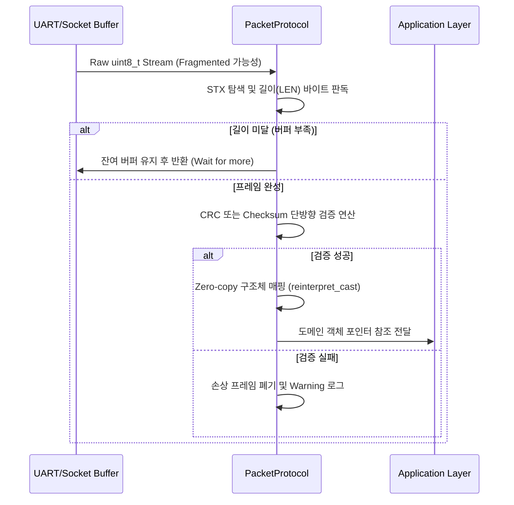

# protocol Module Engineering Specification

## Module Specification
네트워크 전송단 혹은 STM32 엣지 브릿지에서 수발신되는 저수준 바이트 스트림(Raw Byte Stream)을 애플리케이션의 도메인 객체로 변환하거나, 그 역방향인 바이너리 패키징을 수행하는 페이로드 규격 분석 및 조립 모듈이다.

## Technical Implementation
- **`PacketProtocol`**: 하드웨어와 통신하기 위한 바이트 헤더/바디 레이아웃 정의 (예: STX, CMD, LEN, DATA, ETX, Checksum 레이아웃). 
- **Binary Serialization/Deserialization**: 바이트 포인터 연산을 통해 특정 오프셋을 읽어들여 16/32비트 포인터 캐스팅을 수행하고, 엔디안(Endianness) 및 패러티 오류 검증을 제공한다.

## Inter-Module Dependency
- **Input**: `network`의 TCP/UDP 버퍼나 `edge_device`의 UART 수신 버퍼에서 올라오는 정렬되지 않은 파편화 바이트 배열 (`uint8_t*`).
- **Output**: 무결성 검증이 완료된 C++ 상위 `struct` 자료형 객체 데이터 (예: `DeviceStatus`). 역직렬화 실패 시 검증 실패 오류를 로깅한다.

## Optimization Logic
- **Zero-copy Deserialization**: `reinterpret_cast`를 통한 오프셋 포인터 매핑 기법을 응용, 동적 버퍼 복사(Deep Copy)를 원천 차단하여 초당 수천 번의 CPU 사이클을 아끼는 저지연 메모리 스와핑 설계를 적용.
- **Static Alignment Check**: 컴파일 타임에 `alignas` 또는 `#pragma pack` 계열 최적화를 고려하여, 패딩 바이트 누수로 인해 발생하는 바이트 정렬 무결성 파괴 현상을 프로토콜 헤더단에서 예방.

## Data Flow Diagram

