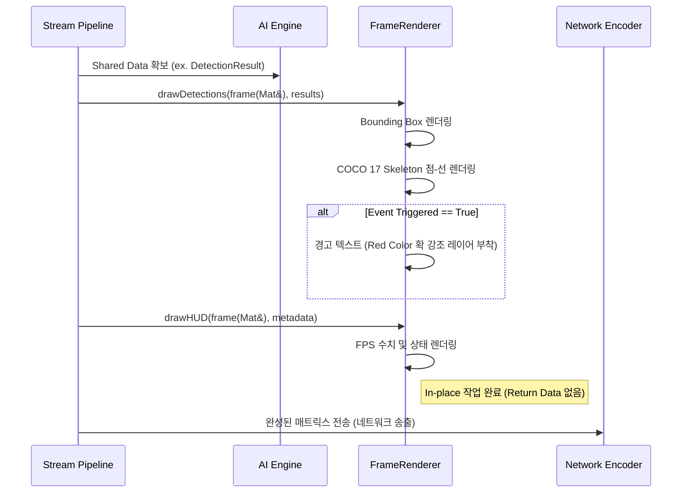

# rendering Module Engineering Specification

## Module Specification
AI 엔진의 산출물인 17포인트 Kpt, Bounding Box 영역 및 트래킹 ID와 시스템 실시간 FPS/상태 메타데이터를 프레임 전면부에 그래픽 오버레이로 고속 렌더링(Drawing)하는 시각화 모듈이다.

## Technical Implementation
- **`FrameRenderer`**: OpenCV 코어의 각종 드로잉 함수(`cv::line`, `cv::putText`, `cv::rectangle`)를 캡슐화한 래퍼(Wrapper).
- **Skeleton & Metadata Annotation**: 전달된 `DetectionResult` 배열을 순회하며 COCO 17-Keypoint 연결 규칙(`AppConfig::KPT_SKELETON`)에 따라 뼈대를 연결하고 특정 상태(예: 낙상 감지됨 RED 알람 박스 등)에 맞는 컬러 매핑을 적용한다.

## Inter-Module Dependency
- **Input**: 시각화 대상 버퍼인 영상 프레임(`stream`의 Processing 루프 제공 `cv::Mat`)과, 렌더링할 정보가 담긴 구조체(`ai`의 `std::vector<DetectionResult>`, `SubCamController`의 통계 문자열 데이터).
- **Output**: 오버레이가 그려진 채로 수정된 원본 스트림(`cv::Mat` 자체)이 되며, 이는 곧장 `transmitter` 또는 `GStreamer` 네트워크 송신 라인으로 보내진다.

## Optimization Logic
- **Mutable Pass-by-Reference (In-place Drawing)**: `std::vector` 로부터 복사 객체를 만들거나 원본 프레임을 새로 `clone()`하여 메모리상에 두벌 복사하는 것을 방지하기 위해 `cv::Mat&` 시그니처를 고수. 1080p 고해상도 환경에서 매 틱(Tick)마다 발생할 수 있는 동적 메모리 재할당 오버헤드를 완전 소멸.
- **Pre-computed Color Maps**: 연산마다 RGB 값을 할당하는 대신 상수화된 팔레트를 배열 접근으로 O(1)에 가져와 캐시 효율성(Cache Locality)을 제고.

## Data Flow Diagram

