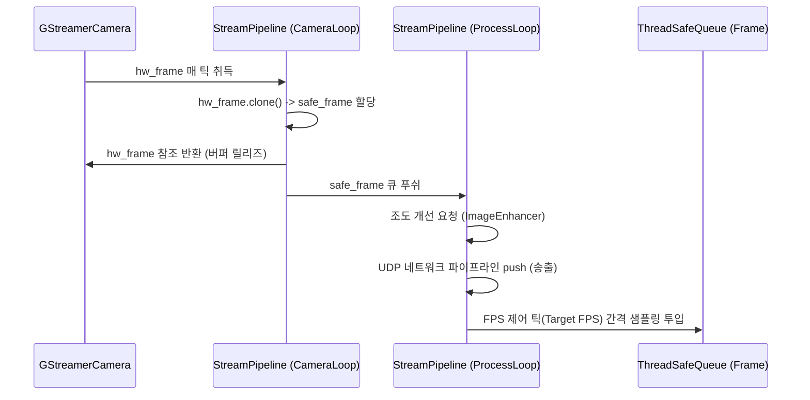

# stream Module Engineering Specification

## Module Specification
카메라 하드웨어로부터 영상 스트림을 수집하고, 데이터 전처리 및 AI 인식 스레드로의 프레임 릴레이, 그리고 원격지 송출 파이프라인(GStreamer) 관리 통제를 관장하는 핵심 영상 처리 엔진이다.

## Technical Implementation
- **`StreamPipeline`**: 캡처, 전처리, AI 추론의 3대 독립 워커 스레드를 발급하고 이들을 이어주는 스레드 안전 큐(`ThreadSafeQueue`) 토폴로지를 구성하는 메인 루프 설계.
- **`GStreamerCamera`**: `libcamerasrc` 및 하드웨어 H.264 인코더 파이프라인을 문자열로 조립하여 OpenCV 백엔드로 초기화하고 실제 픽셀 프레임을 취득(`read()`).

## Inter-Module Dependency
- **Input**: OS 단의 물리적 카메라 센서 리소스(예: `/dev/video0`).
- **Output**: 획득된 프레임을 `imageprocessing`으로 넘겨 화질을 개선하고, 이를 다시 `ai`, `buffer` 로 공급하며 가공된 영상은 `network` 를 통하여 UDP 스트리밍으로 전송한다.
- **Shared Resource**: 메인 애플리케이션 파이프라인 전체의 프레임 큐 객체 인스턴스 소유 및 할당.

## Optimization Logic
- **Memory Leak Zeroing (Clone Strategy)**: 캡처 즉시 하드웨어 버퍼를 OS에 즉각 반환하기 위하여 `cv::Mat::clone()` 깊은 복사(Deep Copy)를 적용, GStreamer의 가장 고질적인 메모리 누수 버그인 `RequestWrap Leak`을 원천 차단한다.
- **Lazy GStreaming**: 애플리케이션 시작 단계에서의 비정상 블로킹을 회피하기 위해 `startStreaming()` 명령 수신 시점까지 파이프라인 `open()`을 보류하는 레이지 초기화 기법 적용.

## Data Flow Diagram

