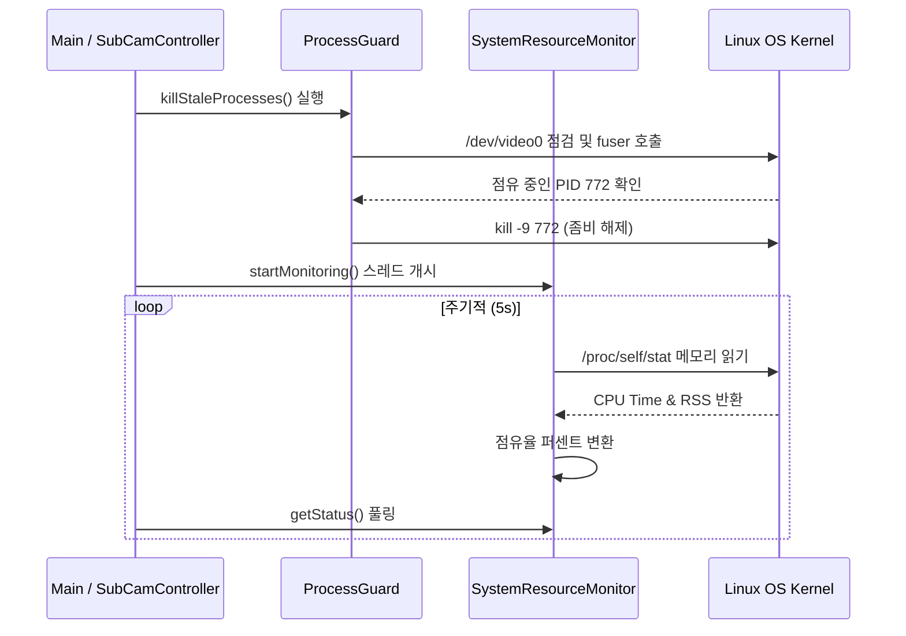

# system Module Engineering Specification

## Module Specification
애플리케이션 외부의 OS 자원을 모니터링하고, 카메라 포트 충돌을 막기 위해 런타임 시작 시 불필요한 좀비 프로세스를 색출 및 제거(Kill)하는 운영체제 맞춤형 시스템 보호 모듈이다.

## Technical Implementation
- **`ProcessGuard`**: `fuser` 시스템 콜 또는 `/proc` 파일 시스템 탐색을 통하여, 앱 구동 전 `/dev/video0` 를 물고 있는 고착화된 다른 미디어 데몬이나 이전 크래시 프로세스의 PID를 강제 소멸(`SIGKILL`)시킨다.
- **`SystemResourceMonitor`**: 현재 프로세스의 `/proc/[pid]/stat` 및 메모리 맵을 파싱하여 실시간 CPU 점유율, RAM 소모율 및 잔여 가용 리소스를 산출한다.

## Inter-Module Dependency
- **Input**: OS 및 커널 시스템 레벨 호출, Linux 시스템 파일(`/proc` 디렉토리 트리).
- **Output**: 감시된 시스템 정보 구조체(`DeviceStatus`)는 `controller`에 의해 주기적으로 추출되어 `network` 모듈을 통한 주기적인 원격 상태 보고용 페이로드로 제공된다.

## Optimization Logic
- **Regex & Fallback Safe-parsing**: 메모리나 CPU를 캐싱할 때 파일 I/O 실패에 대비하여 이중 정규식(Regex) 검사 등 안전판을 갖추었으며, 파일 I/O 시스템 콜을 캐시 히트(Cache Hit) 방식으로 접근하여 오버헤드를 낮추었다.
- **Detached Watchdog**: 시스템 자원을 통계내는 루프는 메인 카메라/AI 영상 처리에 어떤 레이턴시 인터럽트도 주지 않기 위해 정주기 백그라운드 Sleep 스레드로 완전 격리(Isolate) 설계되었다.

## Data Flow Diagram

