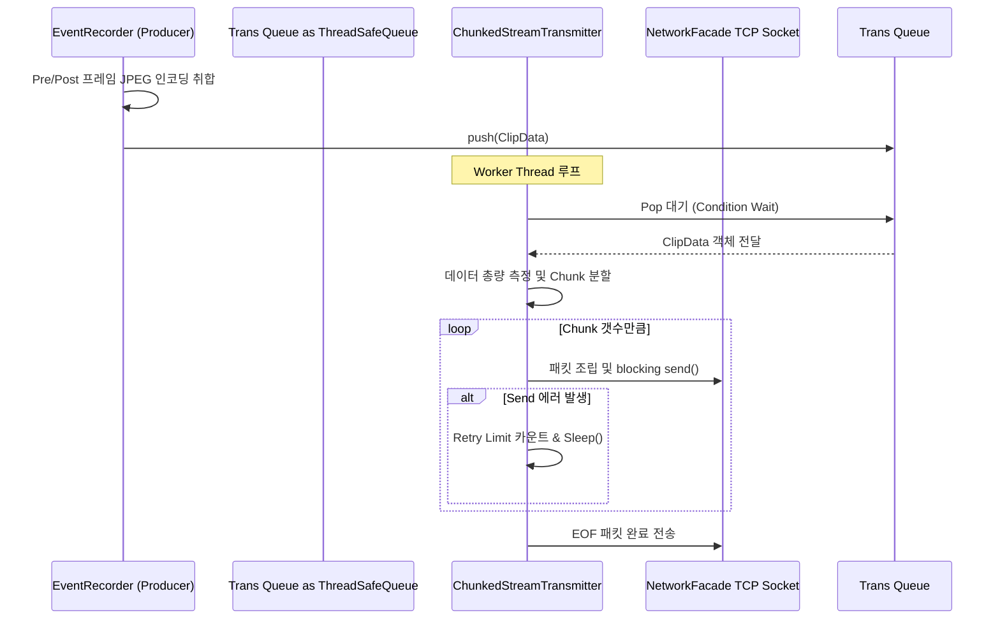

# transmitter Module Engineering Specification

## Module Specification
네트워크 대역폭 상황에 구애받지 않고 대용량 비디오 이벤트 클립 데이터(버퍼)를 사이즈가 작은 단위(Chunk)로 잘게 쪼개어 독립적인 워커 스레드에서 전송하는 대역폭 흐름 제어 송신 모듈이다.

## Technical Implementation
- **`ChunkedStreamTransmitter`**: 단일 TCP 연결 지연 시 전체 카메라 파이프라인이 블록되는 것을 막기 위해, 이벤트 객체 데이터를 분할 페이로드로 래핑하여 비동기 발송하며 전송 실패 시 정해진 횟수만큼 Retry 알고리즘 루프를 수행한다.

## Inter-Module Dependency
- **Input**: 낙상 감지 처리 후 `buffer` 모듈(`EventRecorder`)에서 시간순으로 묶어준 병합된 비디오 압축 묶음(`ClipData`).
- **Output**: `network` 모듈(`NetworkFacade`) 내부에서 할당된 TCP 소켓 인터페이스 및 네트워크 FD로 Raw 바이너리 패킷을 밀어넣어 원격지 소켓 서버에 당도시킨다.

## Optimization Logic
- **Asynchronous I/O Separation**: 영상 캡처 루프가 Blocking `send()` 시스템 콜을 기다리지 않도록 큐(Queue) 기반의 생산자-소비자 패턴을 적용, TCP 네트워크 부하 요인을 백그라운드 스레드로 몰아넣어 메인 스레드 60FPS 성능을 깎지 않도록 구성.
- **Pre-reserved Packet Buffer**: 데이터 직렬화 시 일어나는 동적 `std::vector` 재할당 비용을 제거하기 위해 Chunk 사이즈에 맞춘 Reserve 힙 공간을 재사용(Reuse)한다.

## Data Flow Diagram

