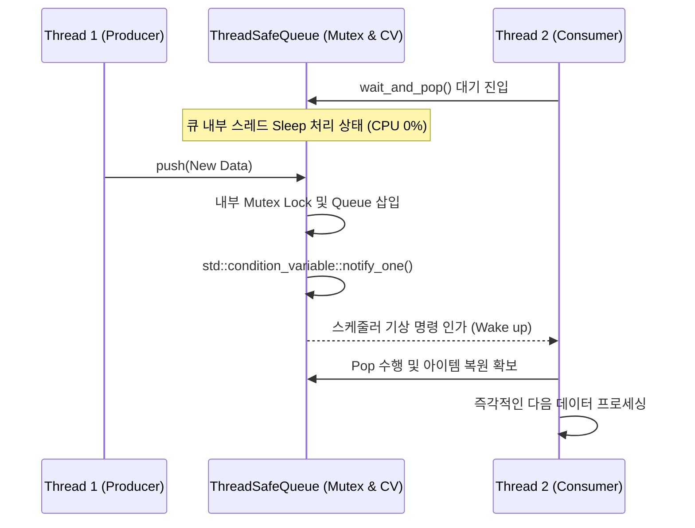

# util Module Engineering Specification

## Module Specification
모듈화된 개별 시스템 전체 계층에서 범용적으로 호출되는 로깅 체계, 동시성 보장을 위한 큐 자료구조, FPS 및 Latency 지연 측정을 위한 실시간 타이머 등 공통(Cross-cutting) 헬퍼 유틸리티 집합이다.

## Technical Implementation
- **`ThreadSafeQueue`**: `std::mutex`와 `std::condition_variable`을 결합한 스레드 안전 Consumer-Producer 템플릿 기반 큐.
- **`PerformanceMonitor`**: 코드 실행 시나리오의 시작과 끝 구간에 부착되어 나노초(nanoseconds) 기반 Latency 및 이동 평균 FPS 수치를 계측, 분석결과를 반환한다.
- **`Logger`**: 애플리케이션 컴파일 타임(Macros) 및 환경 설정에 연동되어, DEBUG 상태일 때만 STD 출력에 개입하여 컬러 지정 및 문자열 템플릿 매핑을 수행한다.

## Inter-Module Dependency
- **Input/Output**: 애플리케이션의 뼈대를 이루는 Leaf(최하위) 구조 모듈로서 다른 상위 도메인 로직에 대한 의존성을 띄지 않고 역으로 모든 모듈들에 #include 방식으로 전파된다.

## Optimization Logic
- **Lock-free Wait (Condition Variable)**: `ThreadSafeQueue::wait_and_pop` 에서 무의미하게 `while` 루프를 도는 Busy-waiting 악습을 타파하고, `std::condition_variable::wait`을 통해 스레드를 Sleep 큐로 밀어넣어 CPU 스핀락 코어 100% 점유율(Bloat) 현상을 완벽 방어한다.
- **Zero-cost Logging Abstraction**: `ENABLE_DEBUG_LOG` 매크로 조건이 false 일 경우, 전처리 파이프에서 로깅 매크로들을 완전히 무효화함으로서, `std::cout` I/O 바운딩에 의한 시스템 병목(마이크로초 누적 부하)을 제로(0) 수준으로 치환한다.

## Data Flow Diagram

