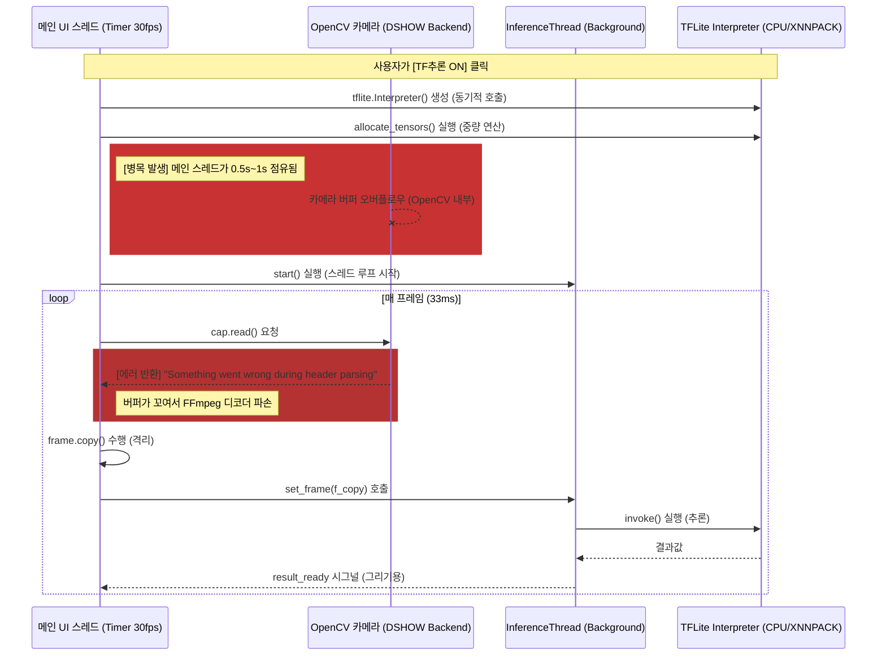

# AI 추론 시작 시 데이터 및 로직 흐름 분석 (Data Flow)

현재 [TF추론 ON] 버튼을 클릭했을 때 영상 데이터가 어떻게 흐르고, 왜 에러가 발생하는지 구조적으로 분석한 자료입니다.

## 1. 현재 시스템 데이터 흐름 (Mermaid Diagram)

---

## 2. 병목 구간 및 에러 발생 지점 (Root Cause)

1.  **동기적 모델 로드 (Main Thread Block)**:
    - `AiRuleView._on_ai_toggled`에서 `self._ai_thread.load_model()`을 호출할 때, `allocate_tensors()`가 메인 스레드에서 실행됩니다.
    - 이때 메인 스레드가 멈추면 OpenCV의 `cap.read()`가 적시에 호출되지 못합니다.
    - **Windows `DSHOW` (MJPG)** 백엔드는 버퍼가 작기 때문에, 적시에 꺼내가지 않으면 스트림이 엉키면서 FFmpeg 디코더가 "헤더 파싱 실패" 에러를 내뱉게 됩니다.

2.  **리소스 할당 충돌**:
    - TFLite가 CPU의 모든 벡터 연산 유닛(AVX/SSE)을 사용해 텐서를 할당하는 순간, OpenCV의 MJPG 디코더가 사용할 자원이 부족해져 하드웨러 프레임 드롭이 발생할 수 있습니다.

---

## 3. 해결을 위한 로직 개선 방향

1.  **비동기 로딩**: `load_model()` 자체를 `InferenceThread` 내부의 `run()` 시작 시점으로 이동시켜 메인 스레드 점유를 0으로 만듭니다.
2.  **카메라 잠시 정지**: AI 로딩 중에는 카메라 타이머를 잠시 멈추고, 로딩이 완료된 후 다시 `start()` 하도록 시퀀스를 조정합니다.
3.  **리소스 우선순위**: `num_threads`를 낮게 시작하고 단계적으로 올리는 방식을 채택합니다.
