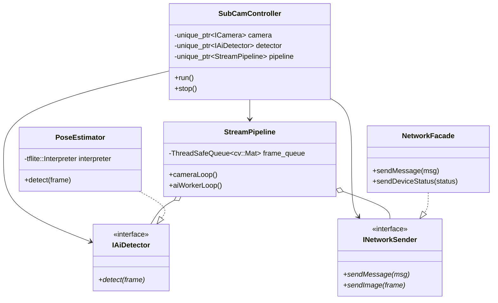
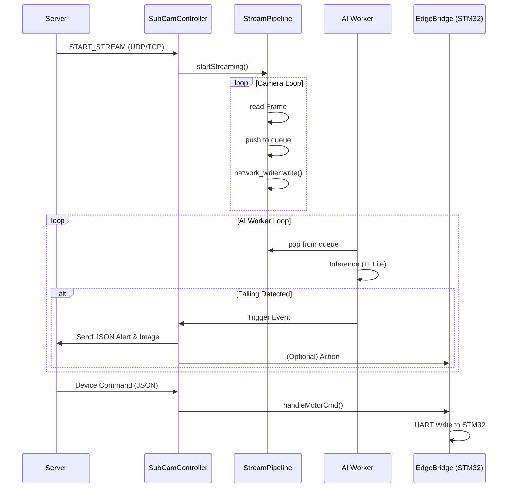

# SubCameraApp 통합 기술 문서 (Comprehensive Technical Report)

## 목차 (Table of Contents)
1. [개요 (Overview)](#1-개요-overview)
2. [시스템 아키텍처 및 상세 설계](#2-시스템-아키텍처-및-상세-설계)
    - [폴더 구조 (Folder Structure)](#2-1-폴더-구조-folder-structure)
    - [컴포넌트 의존성 및 데이터 흐름](#2-2-컴포넌트-의존성-및-데이터-흐름)
3. [주요 모듈 및 클래스 상세 설명](#3-주요-모듈-및-클래스-상세-설명)
    - [Controller 모듈](#3-1-controller-모듈)
    - [AI 및 이미지 처리 모듈](#3-2-ai-및-이미지-처리-모듈)
    - [스트림 및 하드웨어 연동 모듈](#3-3-스트림-및-하드웨어-연동-모듈)
    - [네트워크 및 프로토콜 모듈](#3-4-네트워크-및-프로토콜-모듈)
4. [시각화 자료 (Diagrams)](#4-시각화-자료-diagrams)
    - [클래스 다이어그램 (Class Diagram)](#4-1-클래스-다이어그램-class-diagram)
    - [시퀀스 다이어그램 (Sequence Diagram)](#4-2-시퀀스-다이어그램-sequence-diagram)
5. [최적화 기법 (Optimization)](#5-최적화-기법-optimization)
    - [메모리 최적화 및 자원 관리](#5-1-메모리-최적화-및-자원-관리)
    - [AI 및 연산 성능 최적화](#5-2-ai-및-연산-성능-최적화)
6. [트러블슈팅 기록 (Troubleshooting)](#6-트러블슈팅-기록-troubleshooting)

---

## 1. 개요 (Overview)
`SubCameraApp`은 라즈베리파이 4B 환경에서 동작하는 무인 보안/관제 시스템의 핵심 애플리케이션입니다. 실시간 카메라 스트리밍, TFLite 기반 AI 객체 감지(포즈 추정 및 낙상 감지), 그리고 STM32 기반 외장 장치(모터, 릴레이 등) 제어 기능을 통합하여 제공합니다. 본 문서는 시스템의 구조와 핵심 로직, 그리고 성능 최적화 과정을 상세히 기술합니다.

---

## 2. 시스템 아키텍처 및 상세 설계

### 2.1. 폴더 구조 (Folder Structure)
```text
src/
├── ai/                # AI 추론 엔진 및 로직 (TFLite 기반)
│   ├── PoseEstimator  # 포즈 추정 및 핵심 감지기
│   ├── FallDetector   # 낙상 판정 로직
│   └── PersonTracker  # 객체 추적 및 ID 할당
├── buffer/            # 프레임 버퍼링 및 이벤트 데이터 관리
│   ├── CircularFrameBuffer # Pre-event 녹화용 순환 버퍼
│   └── EventRecorder  # 이벤트 트리거 기반 클립 수집기
├── controller/        # 시스템 총괄 (Composition Root)
│   └── SubCamController # 전체 컴포넌트 생명주기 관리 및 의존성 주입
├── edge_device/       # STM32 UART 브릿지 및 장치 제어
├── imageprocessing/   # 이미지 전처리 및 저조도 개선 알고리즘
├── network/           # 서버 통신 (TCP/UDP, Beacon, Command)
├── protocol/          # 서버-장치 간 바이너리 패킷 규격
├── rendering/         # 프레임 시각화 (Bounding Box, Skeleton)
├── stream/            # GStreamer 기반 카메라 입출력 파이프라인
├── system/            # 자원 모니터링 (CPU, Memory, Queue 상태)
└── util/              # 공용 유틸리티 (ThreadSafeQueue, FrameSaver 등)
```

### 2.2. 컴포넌트 의존성 및 데이터 흐름
- **의존성 주입 (DI)**: `SubCamController`에서 모든 구체 클래스를 생성하고 인터페이스(`ICamera`, `IAiDetector` 등)를 통해 주입하는 형태를 취하여 결합도를 낮췄습니다.
- **데이터 흐름**: `Camera` → `Enhancer` → `CircularBuffer` & `AIQueue` → `AI Worker Loop` → `Detector` → `Tracker` → `FallCheck` → `Network/Saver`.

---

## 3. 주요 모듈 및 클래스 상세 설명

### 3.1. Controller 모듈
#### `SubCamController`
- **역할**: 시스템의 주 진입점이자 오케스트레이터입니다.
- **주요 함수**:
    - `run()`: 메인 루프 실행 및 네트워크 명령 대기.
    - `handleServerCommand()`: 서버로부터 수신된 명령(스트리밍 시작, 모터 제어 등)을 분석하여 각 모듈로 전달.
- **자원 해제**: `stop()` 함수 호출 시 EdgeBridge, Pipeline, Network 순으로 안전하게 정지시키며, `unique_ptr`를 통해 힙 메모리를 자동 관리합니다.

### 3.2. AI 및 이미지 처리 모듈
#### `PoseEstimator` (IAiDetector 상속)
- **파라미터**: `model_path` (TFLite 가중치 파일), `preprocessor` (이미지 처리 엔진).
- **역할**: 입력 이미지에서 사람의 골격(Keypoints) 정보를 추출합니다.
- **최적화**: TFLite 인터프리터 스레드를 제한하여 CPU 경합을 방지합니다.

#### `RetinexEnhancer` (IImageEnhancer 상속)
- **역할**: 야간 또는 저조도 환경에서 프레임의 가시성을 개선합니다.
- **최적화**: CPU 부하가 큰 `bilateralFilter` 대신 `boxFilter`를 사용하고 불필요한 연산을 제거하여 실시간성을 확보했습니다.

### 3.3. 스트림 및 하드웨어 연동 모듈
#### `StreamPipeline`
- **역할**: 카메라 캡처(`cameraLoop`)와 AI 추론(`aiWorkerLoop`) 대행진을 관리하는 듀얼 스레드 구조입니다.
- **데이터 교환**: `ThreadSafeQueue`를 통해 프레임을 안전하게 전달합니다.

#### `EdgeBridgeModule`
- **역할**: 서버의 제어 신호를 STM32 UART 프로토콜로 변환하여 장치를 제어하고, 장치 상태를 서버로 릴레이합니다.

### 3.4. 네트워크 및 프로토콜 모듈
#### `NetworkFacade`
- **인터페이스**: `INetworkSender`, `ICommandReceiver`.
- **역할**: 명령 수신 소켓을 재사용하여 AI 이벤트 정보와 이미지 데이터를 하나의 채널로 통합 전송합니다.

---

## 4. 시각화 자료 (Diagrams)

### 4.1. 클래스 다이어그램 (Class Diagram)


### 4.2. 시퀀스 다이어그램 (Sequence Diagram)


---

## 5. 최적화 기법 (Optimization)

### 5.1. 메모리 최적화 및 자원 관리
- **Stack vs Heap**:
    - **Heap**: 컴포넌트 구조가 크고 생명주기가 긴 엔진류(Controller, Pipeline 등)는 `unique_ptr`를 사용해 힙에 할당하여 가동 시간 중 소멸 방지 및 댕글링 포인터 예방.
    - **Stack**: 프레임 루프 내부의 연산 데이터, 좌표값(`cv::Rect`, `cv::Point`) 등 소규모 데이터는 스택을 사용하여 메모리 할당/해제 오버헤드를 제로화.
- **불필요한 복사 제거 (Zero-copy)**:
    - **AI 큐 전달**: `cv::Mat::clone()`을 제거하고 OpenCV의 참조 카운팅 시스템을 이용한 얕은 복사로 프레임을 전달하여 메모리 대역폭 소모를 최소화합니다.
    - **TFLite 입력**: `preprocessToTensor()`를 도입하여 전처리 결과가 TFLite 입력 텐서 메모리 영역에 직접 기록되도록 설계, 최종 추론 전의 Deep Copy를 완전히 제거했습니다.
- **Resource Leak 방지**: RAII 패턴과 `std::lock_guard`를 철저히 준수하여 스레드 정지 시 교착 상태(Deadlock) 및 리소스 유출 방지.

### 5.2. AI 및 연산 성능 최적화
- **SIMD 활용**: TFLite의 XNNPACK 델리게이트를 통해 ARM NEON 기술을 내부적으로 활용하여 부동소수점 연산 가속.
- **병렬 처리**: AI 전용 Worker 스레드를 분리하고, 카메라 캡처 스레드에 높은 우선순위(`SCHED_RR`)를 부여하여 커널 레벨의 프레임 드랍 방지.
- **알고리즘 최적화**: 
    - AI 추론 주기(`AI_INFERENCE_INTERVAL`)를 기반으로 모든 프레임이 아닌 특정 간격으로만 AI를 수행하여 CPU 온도 상승 및 스로틀링 억제.
    - 저조도 강화 알고리즘에서 연산량이 많은 필터를 경량 필터(BoxFilter)로 대체.

---

## 6. 트러블슈팅 기록 (Troubleshooting)

| 문제 상황 | 해결 방법 | 적용 결과 |
| :--- | :--- | :--- |
| AI 추론 지연 (1.5s+) | `-O3`, `-ffast-math` 등 하드웨어 최적화 컴파일 옵션 적용 및 `NUM_THREADS` 제어 | 실시간성 확보 (30 FPS 유지) |
| 네트워크 소켓 고갈 및 연결 거부 | 별도 소켓 생성이 아닌 기존 명령 채널 소켓을 재사용하도록 프로토콜 통합 | 24/7 구동 시에도 안정적인 전송 유지 |
| 종료 시 RequestWrap Assertion | 스레드 `join()` 순서와 GStreamer `release()` 순서를 명시적으로 정렬 | 깨끗한 시스템 종료 확인 |
| `std::queue` 경합으로 인한 Crash | ThreadSafeQueue(Mutex + Condition Variable) 도입 | 비정상 종료 현상 완벽 제거 |
| 메모리 무한 증식 (네트워크 지연 시) | EventRecorder 큐에 상한(Max 5) 및 감지 쿨다운 적용 | 메모리 점유율 일정하게 유지 |

---
*Generated by Antigravity AI Architecture Team*
